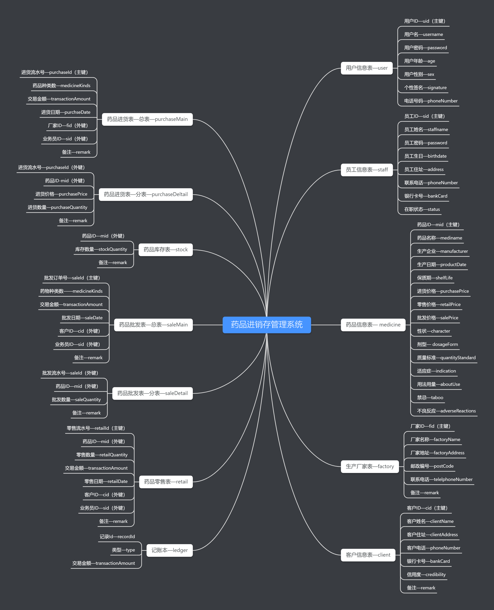

# DataDesign
数据库课程设计—药品进销存系统。


## 运行环境

▶ JDK 1.8

▶ MySQL 8.0.20

▶ IDE IntelliJ IDEA


## 项目结构

非Maven项目，需要手动添加lib（jdbc + log4j）。

```
DataDesign
├─img 图片
├─lib 第三方依赖
├─sql 数据库脚本
└─src
    └─com
        └─kag
            ├─common  通用工具
            ├─dao     数据持久
            ├─entity  领域对象
            ├─gui     图形界面
            └─service 业务逻辑  
```


## 数据库设计




## 测试运行

先创建数据库`medata`，然后导入sql中的脚本`medata.sql`。

将项目导入到IDE中， 运行Application即可，以下是测试账号：

|   角色   | username  | password |
| :------: | :-------: | :------: |
|  Admin  | Khighness |  111111  |
| Staff |  南宫羽   |  333333  |


